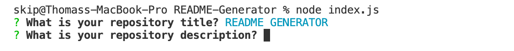
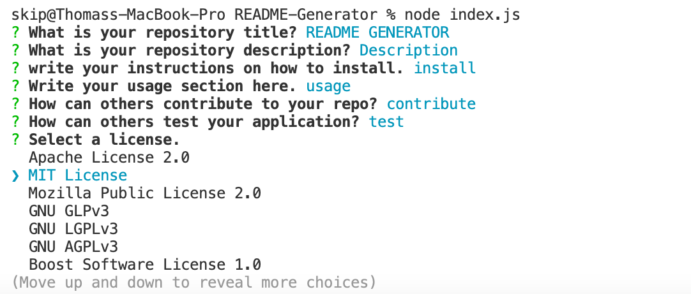
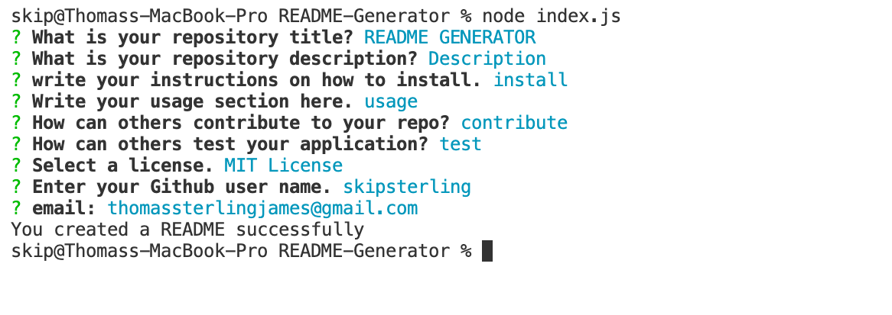

# README-Generator

## Description
I wanted to create this application to make creating a README.md file quicker and easier. I have provided information on how to Use, Gaining access to common licenses and how you can get in contact with me as well as a walkthrough video on how to use this project.

## Usage
In using this project we will save time and effort in creating a README.md file. Do this at the very start of creating your project. To call it you'll have to do so from the command line. 
Once it has been called you will have to answer a series of questions in relation to your README.md file that you are creating.
Step 1 Go to your command line and type in node index.js and then press enter.

Step 2 Type your answer in and press enter to move to the next question and continue this process 
Once you get to the to the section where you need to choose a license you can move to the different options by pressing the up and down keys then press enter to select one. 

Once this process is complete and all questions are answered you will have your new README file called 1README.md so as n ot to confuse the two README files and will have the command line say "You created a README successfully!"

## License 
Add badges from the following link
<a href="https://shields.io/" >Sheilds</a>

## Walkthrough Video
Click here to watch a walkthrough video on how to install and use. <a href="https://drive.google.com/file/d/1QwsiFLppnYCSCrT45jPepn6XXmjN4h6V/view?usp=sharing">Walkthrough</a>

## Questions
If you have any further questions you can find my details on github (https://github.com/skipsterling)
or you can contact me directly via email. thomassterlingjames@gmail.com
